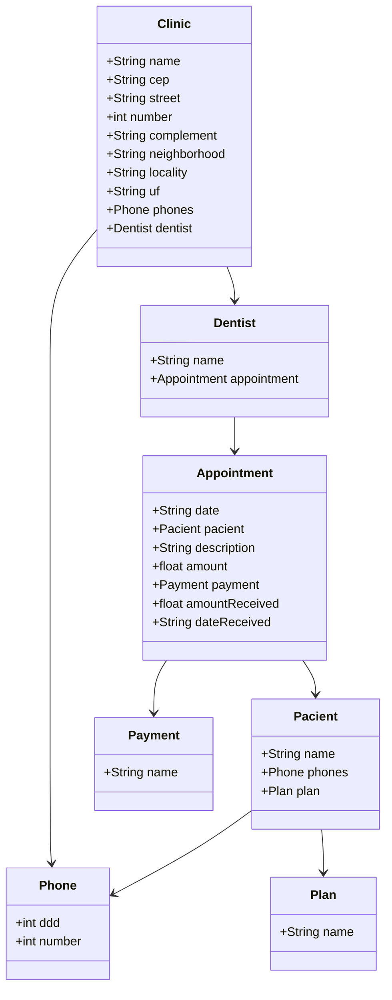

# Odonto API

API RESTFul criada para controlar atendimentos e valores recebidos.

Construída em Java 17 com Spring Boot 3.

## Principais Tecnologias
- **Java 17**: Utilizaremos a versão LTS mais recente do Java para tirar vantagem das últimas inovações que essa linguagem robusta e amplamente utilizada oferece;
- **Spring Boot 3**: Trabalharemos com a mais nova versão do Spring Boot, que maximiza a produtividade do desenvolvedor por meio de sua poderosa premissa de autoconfiguração;
- **Spring Data JPA**: Exploraremos como essa ferramenta pode simplificar nossa camada de acesso aos dados, facilitando a integração com bancos de dados SQL;
- **OpenAPI (Swagger)**: Vamos criar uma documentação de API eficaz e fácil de entender usando a OpenAPI (Swagger), perfeitamente alinhada com a alta produtividade que o Spring Boot oferece;
- **Railway**: facilita o deploy e monitoramento de nossas soluções na nuvem, além de oferecer diversos bancos de dados como serviço e pipelines de CI/CD.

## Diagrama de Classes (Domínio da API)

## Documentação da API (Swagger)

### [https://sdw-2023-prd.up.railway.app/swagger-ui.html](https://sdw-2023-prd.up.railway.app/swagger-ui.html)

Esta API ficará disponível no Railway por um período de tempo limitado, mas este é um código-fonte aberto. Portanto, sintam-se à vontade para cloná-lo, modificá-lo (já que é um bom projeto base para novos projetos) e executar localmente ou onde achar mais interessante! Só não esquece de marcar a gente quando divulgar a sua solução 🥰

### IMPORTANTE

Aos interessados no desenvolvimento da tela inicial do App do Santander (Figma) em Angular, Android, iOS ou Flutter... Caso a URL produtiva não esteja mais disponível, deixamos um Backup no GitHub Pages, é só dar um GET lá 😘
- URL de Produção: https://sdw-2023-prd.up.railway.app/users/1
- Mock (Backup): https://digitalinnovationone.github.io/santander-dev-week-2023-api/mocks/find_one.json